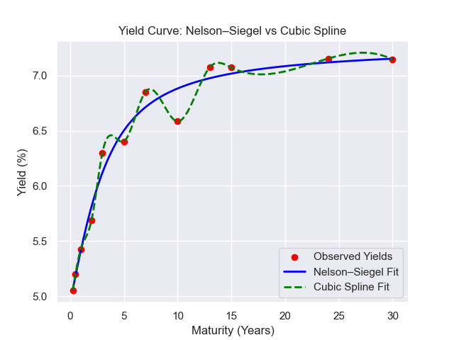

# Yield Curve Modeling: Nelson–Siegel vs. Cubic Spline

## Overview
This project analyzes Indian Government Securities (G-Secs) yields across multiple maturities and compares two yield curve fitting approaches:
1. **Nelson–Siegel Model**
2. **Cubic Spline Interpolation**

The aim is to:
- Model the yield curve using short-to-long maturities (6 months to 30 years).
- Compare the fits in terms of accuracy and interpretability.
- Discuss the ethics of smoothing yield curve data.

---

## Data
- **Source**: `yields.csv` containing daily G-Sec yields.
- **Maturities**: 3M, 6M, 1Y, 2Y, 3Y, 5Y, 7Y, 10Y, 13Y, 15Y, 24Y, 30Y.
- **Cleaning**:  
  - Removed rows where **any maturity yield > 11%** (to eliminate outliers).
  - No missing values after cleaning.

---

## Exploratory Analysis

Plotted the full time series of yields for all maturities.

Created pairwise distribution plots (KDE + scatter) to understand correlations between maturities.

Visualized example yield curves for specific dates (e.g., 2020-01-03, 2020-01-10).

Identified dates with yield curve inversion (2-year > 10-year) vs. normal slope.

### Treasury Yields Over Time


### Pairwise Distribution and KDE


### Example Yield Curve (2020-01-03)


---

## Model Fitting

### Nelson–Siegel Model
Parametric model:
\[
y(t) = \beta_0 + (\beta_1 + \beta_2) \frac{1 - e^{-t/\tau}}{t/\tau} - \beta_2 e^{-t/\tau}
\]

- **β₀**: Long-term rate level  
- **β₁**: Short-term slope  
- **β₂**: Medium-term curvature  
- **τ**: Decay factor controlling hump position  

Fitted using:
```python
from nelson_siegel_svensson.calibrate import calibrate_ns_ols
curve_ns, status = calibrate_ns_ols(t, y, tau0=1.0)
```

---
## Example: 2020-01-10 Yield Curve Fit

  - Red dots: Observed yields

  - Blue line: Nelson–Siegel fit

  - Green dashed: Cubic Spline fit
---
## Comparison Table

| Aspect               | Nelson–Siegel                                          | Cubic Spline                            |
| -------------------- | ------------------------------------------------------ | --------------------------------------- |
| **Fit Accuracy**     | Smooth parametric fit; may not hit all points exactly. | Exact interpolation through all points. |
| **Interpretability** | Parameters have economic meaning.                      | Purely mathematical.                    |
| **Extrapolation**    | Stable beyond observed maturities.                     | Can behave unpredictably outside range. |
| **Overfitting Risk** | Low (4 parameters).                                    | High — fits all noise exactly.          |

### Ethical Question: Is Nelson–Siegel “unethical” because it smooths the yield curve?
Short answer: No — smoothing in Nelson–Siegel is not inherently unethical.

Reasoning:

Nelson–Siegel isn’t distorting reality; it’s modeling the underlying yield term structure in a parsimonious way.

The goal is to extract the signal (true term structure) from noisy market observations.

Unethical smoothing would be deliberate manipulation to mislead stakeholders (e.g., hiding risk or losses).

In finance, smoothing models like Nelson–Siegel are widely accepted for yield curve estimation because:

They’re transparent and documented.

They’re reproducible.

They provide interpretable parameters for policy and risk analysis.
